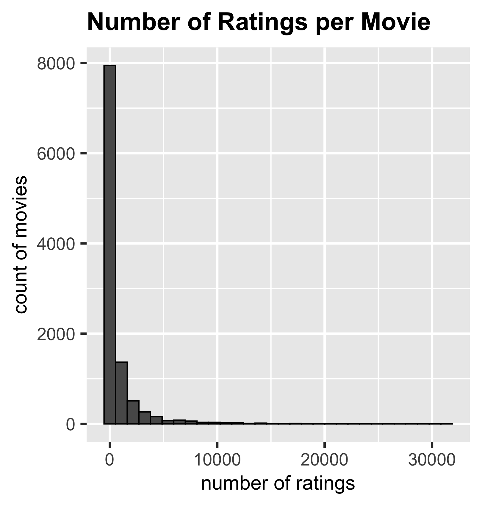
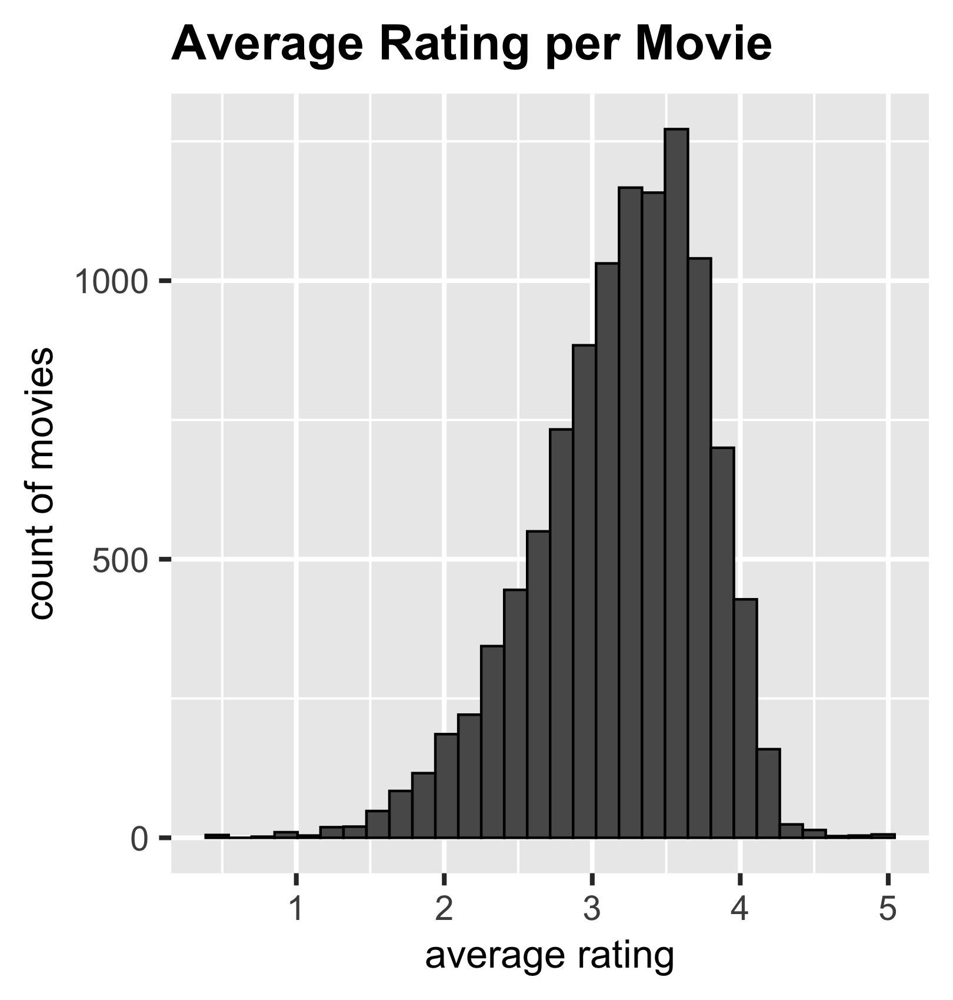
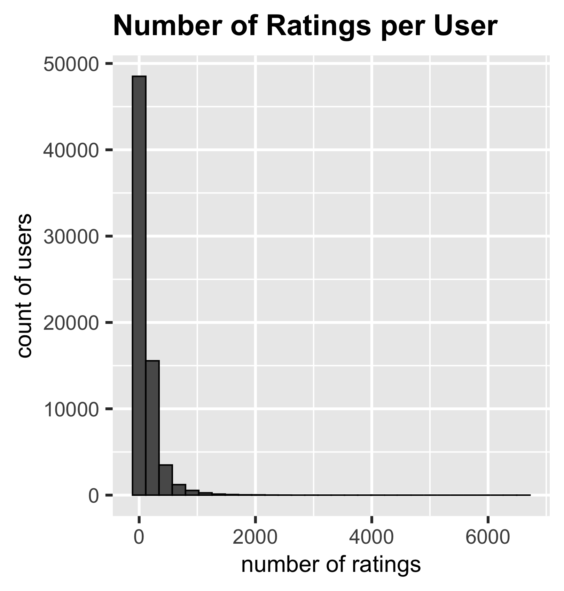
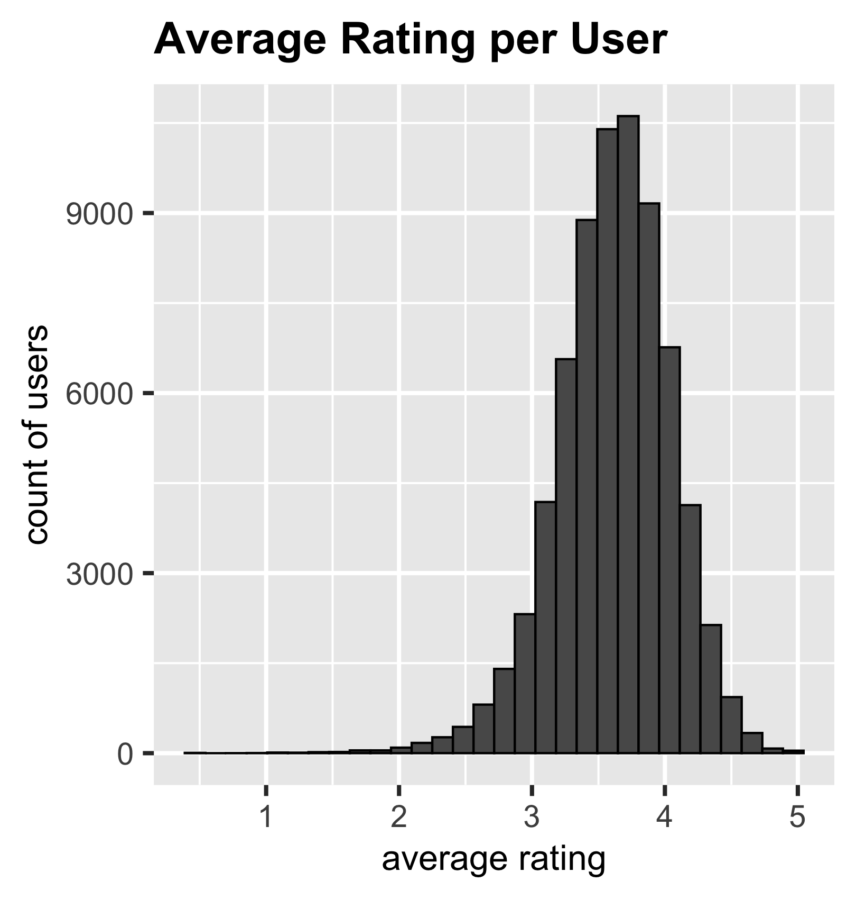
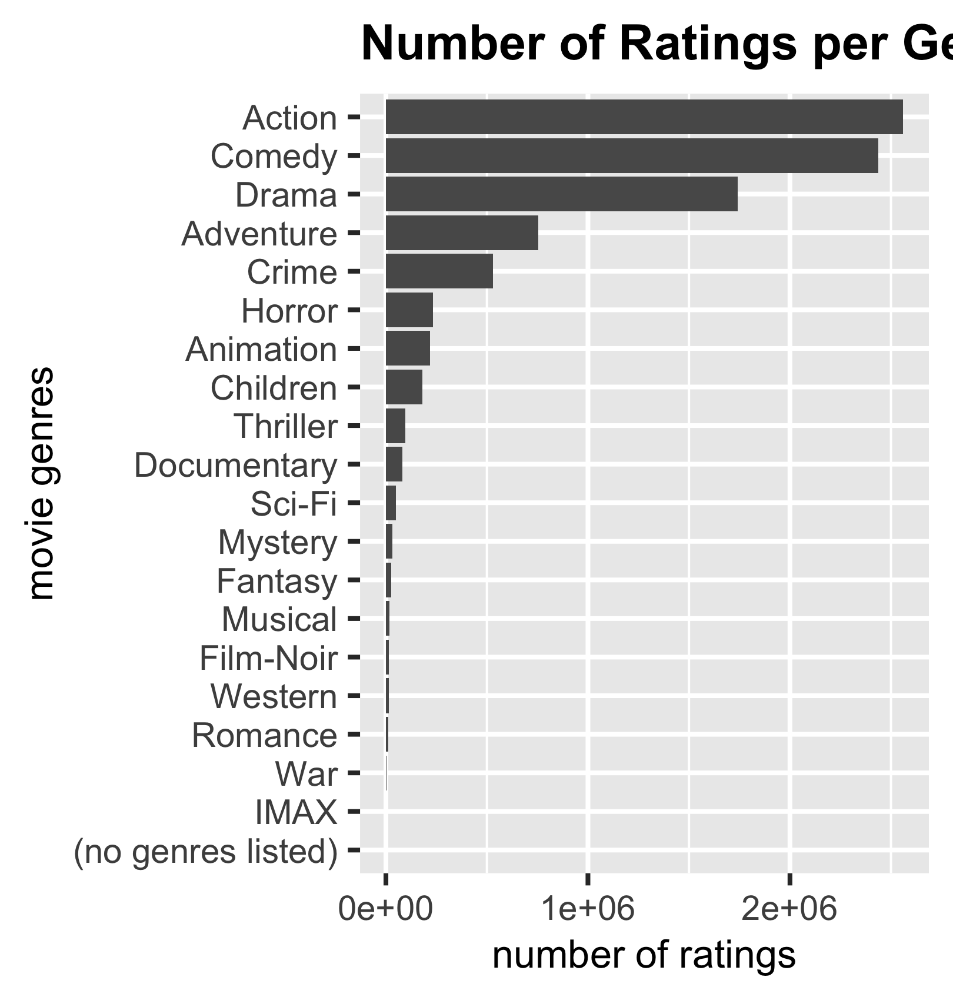
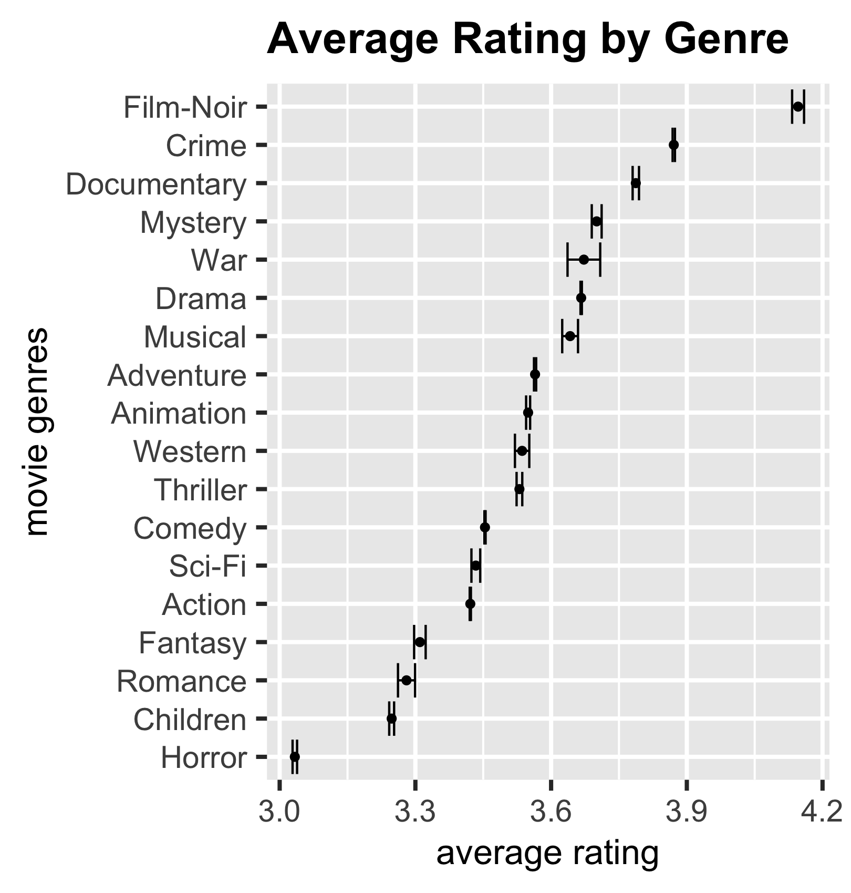
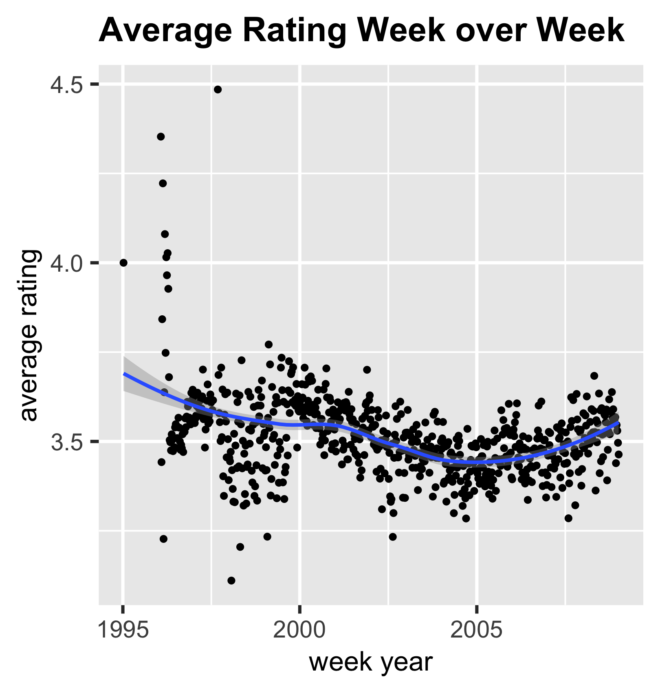
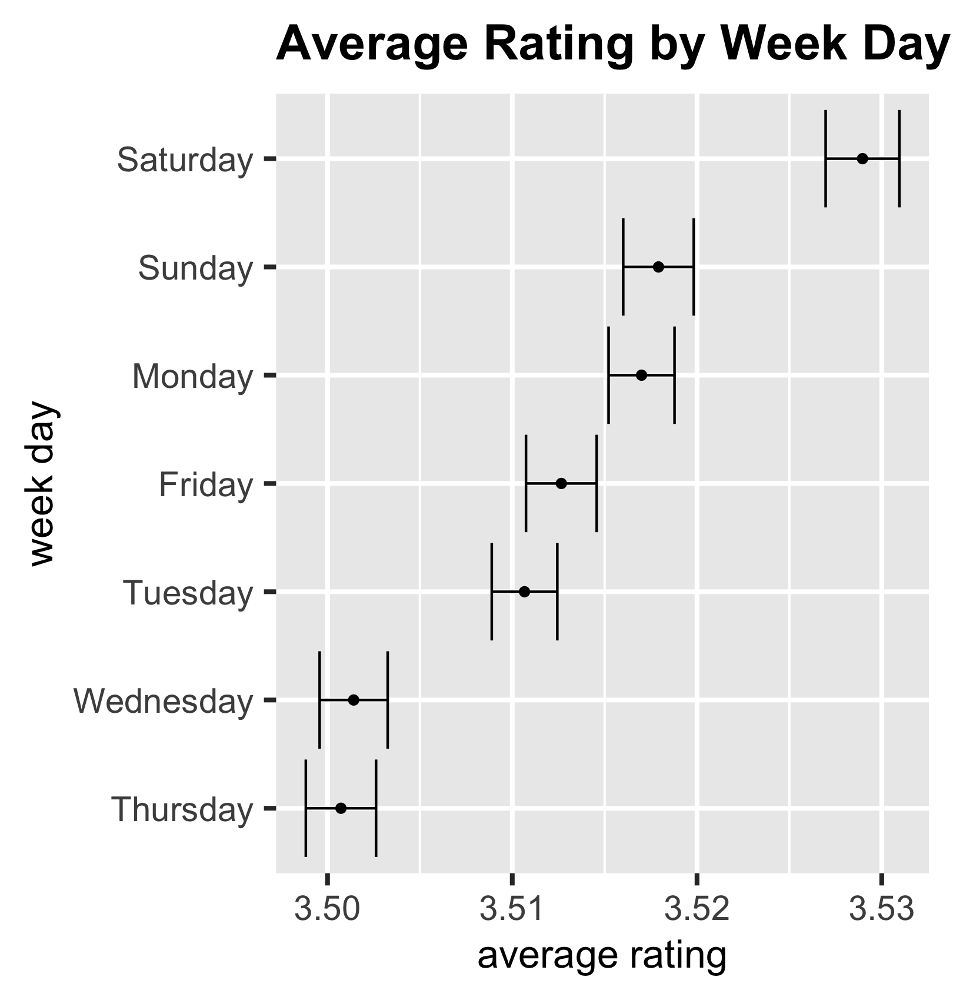
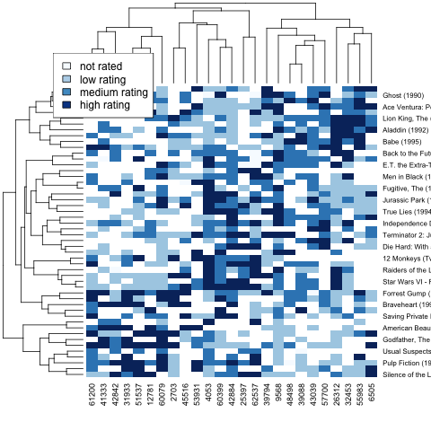

```{r setup, include=FALSE}
knitr::opts_chunk$set(
  echo        = TRUE,    
  message     = FALSE,   
  warning     = FALSE)    
```

```{r load, echo=FALSE}
library(tidyverse)
load("rdas/edx.rda")
load("rdas/results.rda")
```
------------------------------------------------------------------------
# Introduction

## Objective 

This project builds an algorithm that predicts the ratings for a movie that a user has not yet seen, using ratings given by other people. These type of algorithms are known as "recommendation systems", because predicted ratings are used to recommend other movies that a user might like. Recommendation systems are widely used not only in entertainment to rate movies or music but also in eCommerce to propose new items to add to a shopping cart. 

## Dataset Description

To develop our algorithm, we use the `edx` dataset which is a random 90% partition of the observations in the `MovieLens 10M` file that can be downloaded here: <https://grouplens.org/datasets/movielens/10m/>

`edx` contains `r nrow(edx)` ratings of `r n_distinct(edx$movieId)` movies by `r n_distinct(edx$userId)` users. Ratings range from 0.5 to 5, with half point increments. Additional attributes include the title of the movie, genres, and timestamp of the rating.

The remainder 10% of the observations (the `validation` set) is used at the end of the project to measure the performance of the algorithm using the residual mean squared error (RMSE).


## Key activities

Following is an outline of the key steps performed in this project:  

- After downloading and cleaning the data, we visualize relationships between movies, users, genres and time. We observe significant variations (biases or effects) in ratings from movie-to-movie, user-to-user, and across genres and time.

- We use these insights to build an algorithm that estimates the rating for a movie as the average across all movies and users after adjusting for the differences that we observe above. Further, we also adjust for noisy estimates due to low number of ratings by using regularization.

- To develop and train our model we use 90% of the observations in `edx` selected at random (the `train_set)`, while we set aside the remainder 10% (the `test_set`) to evaluate the algorithm using the residual mean squared error (RMSE).

- Next, we use hierarchical clustering to uncover similarities in rating patterns by groups of users and movies. We leverage the Recommenderlab package and in particular the matrix factorization SVD algorithm to further improve our model.

- Lastly, we use the `validation` set to run our final test. Results are then presented followed by conclusions and recommended next steps.


# Analysis

## Data Cleaning and Preparation

We start by downloading the MovieLens 10M ratings file, which includes ratings.dat and movies.dat

\small
```{r dowload, echo=TRUE, eval=FALSE}

download.file("http://files.grouplens.org/datasets/movielens/ml-10m.zip", temp)

```
\normalsize

Each line in ratings.dat represents one rating in the form UserID::MovieID::Rating::Timestamp. Likewise, each line of movies.dat represents one movie as MovieID::Title::Genres. After parsing the attributes into two tables, we join them into a dataframe, but exclude observations without ratings.

Finally, we randomly partition the observations in MovieLens into two data sets:  

-  `edx` containing 90% of the observations, used to build and test our algorithm 

-  `validation` with the other 10%, used to conduct the final test at the end of the project 


## Data Exploration and Visulization

The `edx` set is a 90% random split of the $10M observations in `MovieLens`. Each observation consists on the rating of one movie, by one user, at a given time. The first few rows of `edx` look like this:

\small
```{r edx-structure, echo=FALSE, eval=TRUE}

knitr::kable(edx %>% select(userId, movieId, rating, timestamp, title, genres) %>% head())

# calculate number of movies that received at least 100 ratings
movies_over100 <- edx %>%  
  group_by(movieId) %>%
  filter(n()>100) %>%
  ungroup() %>%
  summarize (n_distinct(movieId))

```
\normalsize


### Relationship between Movies and Ratings

The first plot represents the number of ratings per movie. It is skewed towards lower counts, indicating that the majority of movies are infrequently rated. In fact, only `r movies_over100` movies or `r round(movies_over100/n_distinct(edx$movieId),2)*100`% of the total have received more than 100 ratings.

The second plot shows large variations in average rating per movie, and is slightly skewed towards higher values. Likely the result of some "bias" in ratings favoring "blockbusters" or "main stream" productions.
 \newline

```{r movies_figures, echo=FALSE, out.width="45%"}




```


### Relationship between Users and Ratings

Similarly, we display the number of ratings given by each user and its average. Again, the first plot is skewed towards lower counts, suggesting infrequent ratings, while the second chart is skewed towards higher averages, indicating some users are very generous in their evaluations.

```{r user_figures, echo=FALSE, out.width="45%"}




```


### Relationship between Genre and Ratings

Using a boxplot, we observe again high variability in ratings, with "horror" movies getting the lowest average, while "film-noir" gets the best evaluations.
 \newline

```{r genre_figures, echo=FALSE, out.width="45%"}




```
 \newline
 \newline

### Relationship between Time and Ratings

Lastly, we plot rating averages week-over-week and by day-of-the-week. 

The first plot shows that average ratings have been trending down slowly since circa 1995 but started to bounced back around 2005. 

The second chart shows ratings being slightly higher around weekends, suggesting that users moods (arguably, people tend to be more relaxed and happier on weekends) have an effect on ratings.

```{r time_figures, echo=FALSE, out.width="45%"}




```

### Group Patterns  

To explore if there are groups of users or movies with similar rating patterns, we use a subset of the data, `small_edx`, consisting of the 50 most rated movies and the users that have rated at least 25 of them.

#### Clusters of Movies with similar rating patters

After normalizing `small_edx` by removing row and column averages, we calculate the distance between observations and use **hierarchical clustering** to group movies that are close together. Next, we summarize the information with a dendrogram 

\small
```{r movie_clusters, echo=TRUE, eval=FALSE}

h <- dist(small_edx) %>% hclust()

```
\normalsize

```{r m_cluster_plot, echo=FALSE, fig.align='center', out.width="70%", EVAL=TRUE}

load("rdas/distance.rda")  
h<- hclust(d)
plot(h, cex = 0.6, main = "movie clusters", xlab ="", sub="")  # plot with a dendrogram

```

Ratings among users in the same dendrogram branch are closer together. In fact, if we cut the tree into six clusters, and display group 3 and 5, we can see similarities.

\small
```{r movie_groups, echo=TRUE, eval=TRUE}
groups <- cutree(h, k = 10)  # generate  6 groups

names(groups)[groups==3]   # family movies
names(groups)[groups==5]   # blockbusters

```
\normalsize


#### Clusters of Users with similar rating patters

This time, we only include the 25 users with the highest variability in ratings for whom movies are not all the same. We transpose `small_edx` to calculate the distance between ratings and cluster users into groups with similar patters, as seen in the dendrogram below.

\small
```{r user_clusters, echo=TRUE, eval=FALSE}
# calculate the distance between user ratings and cluster in groups
h2 <- dist(t(small_edx)) %>% hclust() 

```
\normalsize

```{r u_cluster_plot, echo=FALSE, fig.align='center', out.width="60%",  EVAL=TRUE}

load("rdas/h2.rda")  
plot(h2, cex = 0.65, main = "user clusters", xlab = "", sub="")  # plot with dendrogram

```


####  Clusters of movies and users 

Finally, we visualize the combined clusters using a heatmap. Areas with similar colors represent groups of users and movies with similar rating patters. Note the large number of missing ratings (white color). 

```{r heatmap,fig.align='center', out.width="70%", echo=FALSE}



```

## Insights

Data exploration has proven very effective in uncovering ratings patterns for movies, users and other attributes. Here is a summary of the insights:

1. Ratings averages are not uniform across movies, users, genres or time. Instead we observe strong variations or biases. 

   +   Some movies are widely perceived as better and receive higher evaluations (**movie effect**)

   +   Some users have a tendency to give higher or lower ratings (**user effect**)

   +   Preferences in genre such as "action movies", that consistently score higher ratings (**genre effect**)

   +   Variations in ratings based on the day of the week, and over time (**time effect**)

2. Some movies are infrequently rated and some users have given very few evaluations, which could skew predictions and lead to noisy estimates.

3. There are groups of movies and groups of users with similar rating patters, as validated using hierarchical clustering.

In the next section with use these insights to build and improve our recommendations algorithm.


# Modeling Approach

We start by leveraging the insight that rating averages are not uniform across movies, users, genres and time, and build a model that adjusts for the different biases or effects. Next, we adjust for infrequent (noisy) ratings using regularization. Finally, we use the **Recommenderlab** package to account for similarities in ratings for groups of users and movies.

## Modeling for Biases or Effects.

### Average of ratings

We start with a basic model *Y~ui~* that predicts the same value *mu* for each movie *i* and user *u*

> ***Y~ui~= mu + **e**~ui~***

with *e~iu~* the random error that explains variations and *mu* the average of all known ratings:

\small
```{r mu, echo=TRUE, eval=FALSE}
mu<- mean(train_set$rating)

```
\normalsize

 
### Adjusting for Movie and User Effects  

Next, we adjust for systemic differences (effects) in ratings by movie and users, represented as:

>  ***Y~ui~= mu + b~i~ + b~u~ + e~ui~*** 

with *b~i~* accounting for movie-to-movie variations in ratings, and *b~u~* user-to-user differences, calculated as:

\small
```{r bi_bu, echo=TRUE, eval=FALSE}

bis <- train_set %>%     # with bis the vector of bi (movie-to-movie variations)
            group_by(movieId) %>% 
            summarize(bi = mean(rating- mu))   

bus <- train_set %>%   # with bus the vector of bu (user-to-user variations)
            left_join(bis, by="movieId") %>%    
            group_by(userId) %>% 
            summarize(bu = mean(rating- mu- bi))   

```
\normalsize

### Adjusting for small sample sizes: Regularization

As previously discussed, we need to penalize large estimates formed with a small number of ratings. This is achieved by adding a "penalty" *lambda* that shrinks estimates with very few ratings *n* and calculating the "regularized" *bi* and *bu* that minimize the RMSE. The model looks like this: 

> ***Y~ui~= mu + reg_b~i~ + reg_b~u~ + e~ui~*** 

and the lambda is estimated using cross-validation:

\small
```{r  reg_bi_bu, echo=TRUE, eval=FALSE}

lambdas <- seq(0, 10, 0.25)   # use-cross validation to optimize for lambda

rmses <- sapply(lambdas, function(l){
  reg_bis <- train_set %>%     # with reg_bis the vector of penalized bi 
                group_by(movieId) %>%
                summarize(reg_bi = sum(rating - mu)/(n()+l))
  
  reg_bus <- train_set %>%      # with reg_bus the vector of penalized bu 
    left_join(reg_bis, by="movieId") %>% 
    group_by(userId) %>%
    summarize(reg_bu = sum(rating - reg_bi - mu)/(n()+l))
  
  predictions <-test_set %>%
    left_join(reg_bis, by = "movieId") %>% 
    left_join(reg_bus, by = "userId") %>% 
    mutate(pred = mu + reg_bi + reg_bu) %>% 
    pull(pred)
  
  return(sqrt(mean((test_set$rating - predictions)^2))) })

```
\normalsize


```{r lambda_plot, echo=FALSE, out.width="50%", fig.align='center',  EVAL=TRUE}
load("rdas/lambdas.rda")  
load("rdas/rmses_l.rda")  

lambda<- lambdas[which.min(rmses)] 
qplot(lambdas, rmses)

```
The plot above shows that the lambda that minimizes the RMSE is `r lambda`

### Adjusting for Genre and Time effects

Finally, we adjust our model for systemic variations in ratings by genre (*g~ui~*) and day of the week (*d~ui~*). The augmented model is:

> ***Y~ui~= mu + reg_b~i~ + reg_b~u~ + g~ui~ + d~ui~ +  e~ui~***

\small
```{r genre, echo=TRUE, eval=FALSE}

guis <- train_set %>%   # vector of genre-to-genre variations in rating (gui)
           left_join(reg_bis, by="movieId") %>%    
           left_join(reg_bus, by="userID")
           group_by(userId) %>% 
           summarize(gui = mean(rating- mu- bi))   
      
duis<- train_set %>%    # vector of day-of-the-week variations in rating (dui)
           left_join(reg_bis, by="movieId") %>%    
           left_join(reg_bus, by="userId") %>%  
           left_join(guis, by="genre1")  %>%
           group_by(weekday) %>%
           summarise(dui = mean(rating- mu- reg_bi- reg_bu- gui))    
      
```
\normalsize

## Using Recommenderlab to account for group patterns

Thus far, we have build a model that adjusts for different biases in ratings across movies, users, genres and time. Next, we leverage the insight that there are groups of movies and users with similar ratings patterns to  augment our model as follows:

> ***Y~ui~= mu + reg_b~i~ + reg_b~u~ + g~ui~ + d~ui~ +  r~ui~ + e~ui~***

with *r~ui~= p~u~q~i~* the residuals for user *u* and movie *i*, given by similarities in user (*p~u~*) and movie (*q~i~*) ratings

We use **RecommenderLab's** implementation of the SVD approximation to decompose de original rating matrix using factorization, so that we can find the closest neighbors by similarities in ratings. We start by adjusting ratings and removing all effects discussed in previous sections. The resulting "residuals" are transformed into a RealRatingMatrix, as required by Recommenderlab. 

\small
```{r residuals, echo=TRUE, eval=FALSE}

# compute the residuals for known ratings
residual <- edx %>%  
                mutate(date = as_datetime(timestamp),week=round_date(date, "week")) %>%
                left_join(reg_bis, by="movieId") %>%
                left_join(reg_bus, by= "userId") %>%
                left_join(guis, by="genres") %>%
                left_join(duis, by="week")
                summarize(res= rating - (mu + reg_bi + reg_bu + gui + dui)) %>%
                pull(res)

 # transform into sparse matrix which is more efficient storing sparse data
edx_matrix <- sparseMatrix(i = edx$userId, j = edx$movieId,  x = residual)

# convert to realRatingMatrix as required by Recommenderlab.
edx_realMatrix <- as(edx_matrix, "realRatingMatrix")
```
\normalsize

Here are the realRatingMatrix residuals for the first 100 users and movies. Note the sparsity (missing ratings) of the matrix

\small
```{r rm_image, out.width="50%", fig.align='center', echo=FALSE, eval=TRUE}
library(recommenderlab)
load("rdas/edx_realMatrix.rda")  
image(edx_realMatrix[1:100, 1:100],
      main = "Residuals for 100 users x 100 movies", xlab="Movies", ylab="Users", sub="")
```
\normalsize

To improve the performance of Recommenderlab, we train our algorithm with users who have rated at least 50 movies, under the assumption that "frequent users" give more robust ratings that lead to better predictions. Next we use Recommenderlab evaluationScheme function to partition data into a training, test and error sets. 

\small
```{r evaluationScheme, echo=TRUE, eval=FALSE}

# train Recommenderlab with "frequent" users who have rated at least 50 movies 
frequent_users <- edx_realMatrix[rowCounts(edx_realMatrix) >= 50 ]

set.seed(123, sample.kind="Rounding") # if using R 3.5 or earlier, use `set.seed()`

# partition data into training, test and error sets, and withhold 30 ratings for evaluation
frequent_users_split <- evaluationScheme(frequent_users, method="split", train= 0.9, given=30)
train_set<- getData(frequent_users_split, "train")  
test_set <- getData(frequent_users_split, "known")  
error_set <- getData(frequent_users_split, "unknown")  
```
\normalsize

Finally, we train Recommenderlab's SVD algorithm by tuning for the number of k-neighbors that minimizes Recommenderlab built-in RMSE function:

\small
```{r Recommender, echo=TRUE, eval=FALSE}

# Train a model using recommenderlab SVD implementation. Tune for the k-neighbor parameter
k_tune <- seq(25,45, 1)

rmses <- sapply(k_tune, function(k){
  model_svd <- Recommender(train_set, method="SVD", param=list(k=k))
  predictions <- predict(model_svd, test_set, type="ratings" )
  RMSE<- calcPredictionAccuracy(predictions, error_set)["RMSE"]
  return(RMSE)
})
```
\normalsize

```{r k_plot, echo=FALSE, out.width="50%", fig.align='center',  eval=TRUE}
load("rdas/k_tune.rda")  
load("rdas/rmses_k.rda")  

k_opt<- k_tune[which.min(rmses)]
RMSE<- min(rmses)

qplot(k_tune, rmses)

```

The plot above shows that the k that minimizes RMSE is `r k_opt`, and the RMSE of the model is `r RMSE`


# Results

In this section we perform the final test on the validation set for the two models we have designed: the "Effects model" and the "Recommenderlab" approach.  Then we discuss the modeling results and overall performance. 

## Final test on the Validation set

### Effects Model

The RMSE returned by testing  the predictions of our "Effects Model" on the validation set is `r results$RMSE[8]`. This is the value we are submitting for this project since it is below the target of 0.86490. 

Here is the snipped of code used for the final test on the validation set:

\small
```{r, final_effects, echo=TRUE, eval=FALSE}
# use full edx set to recalculate reg_bi, reg_bu, gui and dui. 

# make predictions on the validation set with Yui = mu + reg_bi + reg_bu + gui + dui
predictions<- validation %>%
  mutate(date = as_datetime(timestamp), week=round_date(date, "week")) %>%
  left_join(reg_bis, by="movieId") %>%
  left_join(reg_bus, by="userId") %>%
  left_join(guis, by="genres") %>%
  left_join(duis, by="week") %>%
  summarize(pred= mu + reg_bi+ reg_bu + gui + dui ) %>%
  pull(pred)

RMSE<- sqrt(mean((validation$rating - predictions)^2))  # evaluate the RMSE 
```
\normalsize


### Recommenderlab SVD Model

As a stretch goal for this project, we have also developed a model that uses Recommenderlab's SVD algorithm to account for groups of movies and users with similar ratings. Surprisingly, the RMSE returned on the validation set, `r results$RMSE[9]`, was considerably below target. 

Below is a snipped of the proposed code. In practice, we had to break the users rating matrix into several chunks to optimize for memory allocation and expedite processing (code not shown for simplicity, but available in the R script). 

\small
```{r final_recommender, eval=FALSE, echo=TRUE}

# fit the SVD model for "frequent users"  with k that minimizes RMSE
frequent_users <- edx_realMatrix[rowCounts(edx_realMatrix) >= 50 ] 

model_svd<- Recommender(frequent_users, method="SVD", param=list(k=k_opt) )

# predict unknown residuals for frequent users 
preds_realMatrix <- predict(model_svd, frequent_users, type="ratingMatrix") 

# transform RealRatingsMatrix into a matrix and then a dataframe.  
preds_matrix <- getRatingMatrix(preds_realMatrix)

userId <-as.integer(rownames(preds_matrix))
movieId<- as.integer(colnames(preds_matrix))
residual<- as.vector(preds_matrix)

res_freq_users<- data.frame(userId, movieId, residual) 
  
# as above for "infrequent users" who rated less than 50 movies
infrequent_users <- edx_realMatrix[rowCounts(edx_realMatrix) <50, ]

preds_realMatrix <- predict(model_svd, infrequent_users, type="ratings")

preds_matrix <- getRatingMatrix(preds_realMatrix)
  
userId<-as.integer(rownames(preds_matrix))
movieId<- as.integer(colnames(preds_matrix))
residual<- as.vector(preds_matrix)
res_infreq_users <- data.frame(userId, movieId, residual) 

# Combine residuals from "frequent users" and "infrequent users"
res<- rbind (res_freq_users, res_infreq_users)

# make predictions on validation set with Yui = mu + reg_bi + reg_bu + gui + dui + residual
predictions<- validation %>%
    mutate(date = as_datetime(timestamp),week=round_date(date, "week")) %>%
    left_join(reg_bis, by="movieId") %>%
    left_join(reg_bus, by="userId") %>%
    left_join(guis, by="genres") %>%
    left_join(duis, by="week") %>%
    left_join(res, by=c("movieId", "userId")) %>%
    mutate (pred= mu + reg_bi + reg_bu + gui + dui + residual) %>%
    pull(pred)

RMSE<- sqrt(mean((validation$rating - predictions)^2))  # RMSE of predictions against validation set
```
\normalsize


## Modeling Results and Overall Performance

The following table presents the results of each iteration in our model, including the final tests on the validation set for the two proposed models.

\small
```{r results, echo=FALSE}

knitr::kable(results)

```
\normalsize

We started with a basic model that predicted the same value calculated as the average of all known ratings with a RMSE of `r results$RMSE[1]`. As we adjusted for the different biases in our "Effects Model", we saw progressive but smaller improvements ( `r round(results$RMSE[2]-results$RMSE[2],5)` and `r round(results$RMSE[3]-results$RMSE[2],5)`, respectively) . 

Surprisingly, regularization of small sample sizes for movies and users led to a very minor improvement of the RMSE , down `r round(results$RMSE[4]-results$RMSE[3],5)`. Even less remarkable were the adjustments for genres and time effects: `r round(results$RMSE[5]-results$RMSE[4],5)` and `r round(results$RMSE[6]-results$RMSE[5],5)`, respectively.

Combined, the overall RMSE for all effects as measured on the testing set was `r results$RMSE[6]`, below the required target of 0.86490. 

The RMSE returned on the validation set was `r results$RMSE[8]`, also below target. **This is the value that we are submitting for this project**. As expected, this value is very close to what we had measured using the testing set (up only `r round(results$RMSE[8]- results$RMSE[6],5)`), suggesting that there was no over-training. 

As a stretch goal, we have used Recommenderlab's SVD algorithm to model for groups of users and movies with similarities in ratings. We have removed previously identified effects or biases from known ratings before processing the data with Recommenderlab to predict the remaining "residuals". 

While the RMSE calculated on the testing set during the development phase was encouraging (`r results$RMSE[7]`), on the validation set it was `r results$RMSE[9]-results$RMSE[7]` higher.  

This was likely the result of having had to reduce the size of the edx ratings matrix so that it could be processed by Recommenderlab, rather than using all available ratings. 

A faster PC with more compute power and memory that could handle the entire edx matrix might have led to better results. 


# Conclusion

## Summary

We have built an algorithm that predicts ratings for a movie that a user has not yet seen, using ratings given by other people.

Data exploration has showcased that ratings are not uniform. Instead, they are subjected to strong effects (or biases), associated with perceptions (some movies are widely perceived as better), user behavior (some users have a tendency to give higher or lower ratings), preferences (such as "action" movies vs. "comedies") and time. 

**Modeling for effects (or biases)** has proven not only very effective but also very insightful in confirming that movies are not rated at random, leading to a RMSE of `r results$RMSE[8]` on the validation set, below the targeted 0.86490

Surprisingly, our observation of groups of movies and users with similar rating patters, and hence the assumption that users that agree on the ratings for some movies might also agree on their evaluation for others, has not led to better predictions.

We have used **RecommenderLab** implementation of the **SVD approximation** to decompose the original ranking matrix using factorization and to find the closest neighbors by similarities in ratings. Further, we have adjusted known ratings by all previously uncovered effects or biases before processing.

Although the performance on the test set calculated by Recommenderlab's built-in RMSE function was promising (RMSE was `r results$RMSE[7]`), we observed a significant deterioration when testing on the validation  (RMSE of`r results$RMSE[9]`). Therefore, we did not submit this value as the resulting RMSE for this project. Instead, we are proposing several opportunities for improvement in the next sections.  


## Limitations

Modeling for biases or effects has proven to be very effective not only from a performance perspective as measured by RMSE, but also in terms of speed and memory use. 

In contrast, Recommenderlab is easy to implement, but it is computationally expensive, and does not seem to work well with very large and sparse matrices. To make predictions for a group of users, the algorithm needs to process all movies, whether rated or not by the individual users. Tuning for k-neighbors, which required the evaluation of each pair of users and movies was very time consuming, and not scalable for growing amounts of each. 

To train the algorithm on a regular computer with 16 GB memory, we had to reduce the size of the rating matrix before it could be processed by Recommenderlab. 

Rather than selecting observations at random (which preserves the distribution of the original population), we chose to focus on frequent users (those that have rated at least 50 movies) under the assumption that they give more robust ratings that lead to better predictions. But this left us with a set of infrequent users, for which ratings are more sparse, and therefore the prediction performance of Recommenderlab was much lower.

Later, in order to obtain the final predictions on the validation set, we had to further break the matrices of frequent and infrequent users into several chunks so that they could be processed by Recommenderlab.
 

## Future Work

There are opportunities to improve results by using a more powerful computer that can process Recommenderlab with the entire data set. 

Alternatively, we could use random sampling or tuning Recommenderlab for the cutoff for user frequency (at present, the limit was preset at users with 50 or more predictions) or a combination or both. Further, we could improve scalability by reducing dimensions using Pricipal Component Analysis (PCA). 

There are also opportunities to compare the performance of other algorithms in Recommenderlab such as user-based collaborative filtering (UBCF), item-based collaborative filtering (IBCF) or Funk-SVD. 

Also of interest would be to compare results using other libraries in R for recommender systems such as rrecsys or recosystem (see https://gist.github.com/talegari/77c90db326b4848368287e53b1a18e8d )


# References

-  edx course reference book: https://rafalab.github.io/dsbook/
-  Recommenderlab: https://cran.r-project.org/web/packages/recommenderlab/recommenderlab.pdf
-  Recommenderlab vignettes: https://cran.r-project.org/web/packages/recommenderlab/vignettes/recommenderlab.pdf
-  Libraries for recommender systems: https://gist.github.com/talegari/77c90db326b4848368287e53b1a18e8d
